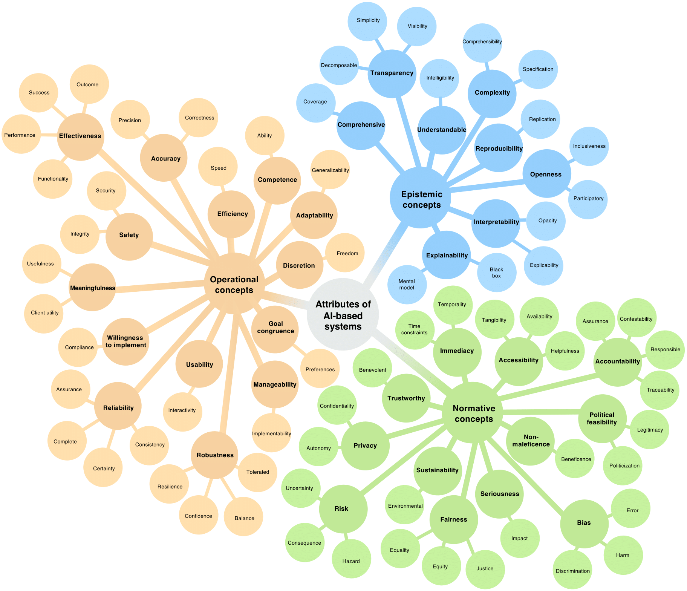
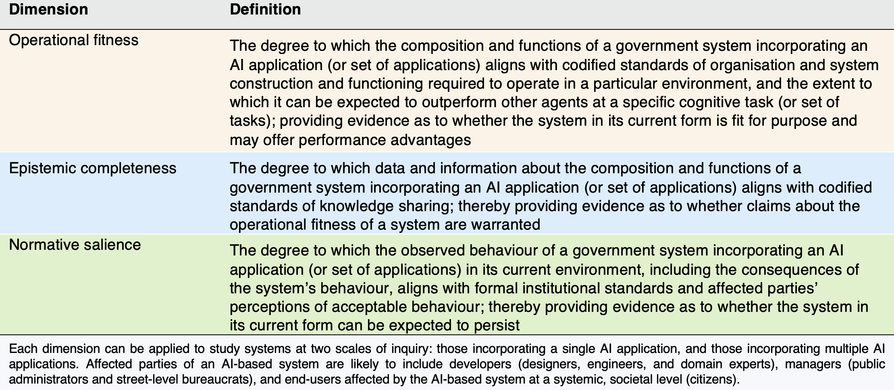
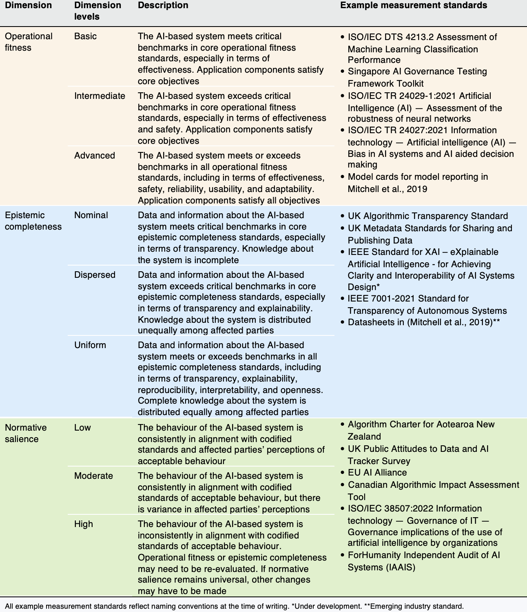
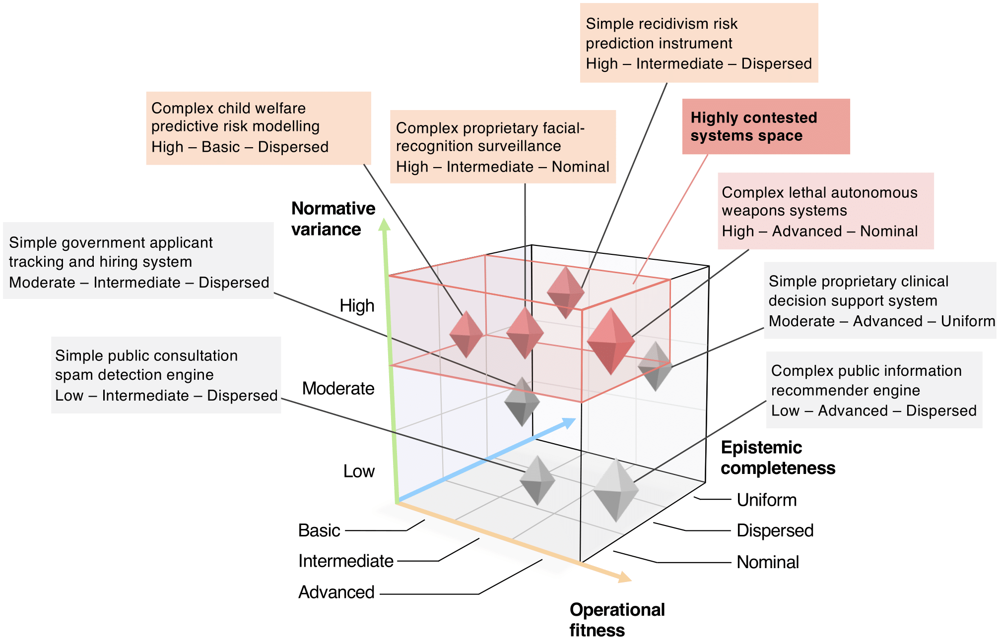

<nav class="toc-fixed" markdown="1">
**Contents**
* TOC
{:toc}
</nav>

This is a companion page for the paper _**Unsupervised feature extraction and clustering of aerial images for understanding hazardous road segments**_ by John Francis, Jonathan Bright, Saba Esnaashari, Youmna Hashem, Deborah Morgan, and Vincent Straub. Tables and figures presented below may be downloaded and reused under a Creative Commons Attribution 4.0 International license. The page is best viewed on a desktop device.

## Summary

Satellite and aerial image data are becoming more widely available, and analysis techniques based on supervised learning are advancing their use in a wide variety of remote sensing contexts. However, supervised learning requires training datasets which are not always available or easy to construct. In this respect, **unsupervised machine learning** techniques present important advantages. This work presents a novel pipeline to demonstrate how available **aerial imagery** can be used to better the provision of services related to the built environment, using the case study of **road traffic collisions** (RTCs) across three cities in the UK. In this paper, we show how **aerial imagery** can be leveraged to extract latent features of the built environment from the purely visual representation of top-down images. Through the **clustering of hazardous road segments** with these latent image features, this work demonstrates how aerial images and machine learning can provide a data-driven aid for road safety experts to enhance their nuanced understanding of how and where different types of RTCs occur.

## Background

Globally, approximately 1.3 million people die each year because of RTCs, and a majority of these deaths fall among vulnerable road users such as pedestrians and cyclists. In the UK, fatal or serious injuries occur on public roads every 16 minutes. In 2020, the United Nations General Assembly resolved to halve the number of global deaths and injuries from RTCs by 2030, noting that the overwhelming majority of these cases are preventable. To achieve this ambitious goal, new technologies and data will be required to enhance road safety experts’ implementation of RTC interventions.

## Methodological Pipeline

we present a pipeline that extracts meaning from aerial images with minimal supervision, and focus on three case study locations within the UK, Cambridge, Gloucester, and Oxford, to demonstrate the application of the pipeline for road safety analysis.

&nbsp;&nbsp;&nbsp;&nbsp;&nbsp;&nbsp;&nbsp;&nbsp;&nbsp;&nbsp;&nbsp;&nbsp;&nbsp;  **Figure 1.** Methodological Pipeline 

  

First, road networks and aerial images were combined into one dataset of evenly spaced road segment points, which were further linked to RTC data. Then, a convolutional autoencoder (CAE), principal component analysis (PCA), and hierarchical clustering are used to extract image features from the data before grouping road segments for analysis and interpretation.

**Operational domain**

The meaning and specific topic shared by concepts in the operational domain broadly relates to understanding the routine activities and functioning of AI-GOV, a particular AI application, administration, bureaucratic actor(s), or policy. 

**Epistemic domain**

Epistemic domain concepts are understood to predominantly deal with knowledge-related attributes, or understanding of, AI-GOV, which are here taken to include a particular AI application, administration, bureaucratic actor(s), or policy.

**Normative domain**

The meaning and topic that concepts in the normative domain collectively express relate to the entitlements, values, and principles of political morality that affected parties hold towards, and expect of, AI-GOV, a particular AI application, administration, bureaucratic actor(s), or policy.

 **Figure 1.** Concepts frequently used to study AI-based systems in government. A concept map connects operational, epistemic, and normative domain (first level nodes) core concepts (second level nodes) and related terms (third level nodes). See Table 1 for a definition of each concept. Size of nodes and weight of arcs are for illustrative purposes and encode no extra information. 

## New concepts
Based on our mapping of the AI in government field, we contend that a new conceptual framework is needed to integrate the diverse conceptual strands that currently permeate scholarship. Here, we try to do so in the following way: we first propose three new, multi-faceted concepts for studying AI-GOV, before using these to construct a novel conceptual 'typology' of AI-GOV, a method to classify observations in terms of their conceptual attributes. We label the new concepts we introduce **operational fitness**, **epistemic completeness**, and **normative salience**, defined below in Table 2.

&nbsp;&nbsp;&nbsp;&nbsp;&nbsp;&nbsp;&nbsp;&nbsp;&nbsp;&nbsp;&nbsp;&nbsp;&nbsp;  **Table 2.** Proposed dimensions to analyse and classify AI systems in government 

  

Table 3 provides full-length definitions of the scales proposed for each dimension and relates each to emerging measurements standards, recommended metrics and methods for the measurement and evaluation of AI technologies. 

&nbsp;&nbsp;&nbsp;&nbsp;&nbsp;&nbsp;&nbsp;&nbsp;&nbsp;&nbsp;&nbsp;&nbsp;&nbsp;  **Table 3.** Characteristics of proposed dimensions to classify AI-based systems in government 

  

## Typology

Our typology of government AI-based systems is formed of three dimensions (concepts), introduced above: operational fitness, epistemic completeness, and normative variance. In making use of these dimensions, our typology serves two main functions. It is both theory-building in the sense that it
serves to characterize AI-GOV and further explicate the meaning of each dimension, and classificatory, in that it places illustrative examples of different types of AI-GOV in conceptually appropriate cells.

 **Figure 2.** Classifying types of AI-based systems in government. A classification schema places select types of AI-based systems in government along three main axes: normative salience, operational fitness, and epistemic completeness. Systems incorporating complex machine learning models (e.g., neural networks, boosted decision trees, random forests) are contrasted with those using simpler ones (e.g., logistic regression, decision lists). ‘Complex lethal autonomous weapons systems’ are classed as highly contested systems (red box), which exhibit high normative salience and possess advanced operational fitness. A 3-point scale for each dimension is adopted for conceptual parsimony; it is anticipated that future standards for grading real-world systems may use different scales. The draft EU AI Act, for instance, uses a 4-point scale to classify the risk level of an AI system. Where possible, placement of systems is informed by surveys of public attitudes towards AI, otherwise systems are placed using authors’ own interpretation. 

## Terminology 

Since we are pursuing a unified account of AI in government, we follow the definitional path trodden by studies on the potential of AI. We in turn use the term ‘AI system’ broadly to refer to a data-driven, machine-based system that can complete—with some degree of autonomy and learning ability—a specific cognitive task (or set of tasks), using ML, agent computing, or related techniques. Unsurprisingly, many other terms are also used in discussions of AI in government; ‘algorithmic system’ and ‘automated decision system’ feature prominently in policy and legal articles, for instance. We adopt ‘AI system’, as this arguably better distinguishes contemporary systems from earlier generations of computer technology, in terms of their unique, data-powered nature and advanced analytics capabilities. Adopting this definition nevertheless enables us to conduct a conceptual analysis that is not restricted only to existing ML-based applications, although much of the scholarship we cover focuses on this. Moreover, we further employ ‘AI-GOV’ to emphasize that all government AI systems operate within social and institutional contexts.

## Citation
John Francis, Jonathan Bright, Saba Esnaashari et al. Unsupervised feature extraction and clustering of aerial images for understanding hazardous road segments, 16 March 2023, PREPRINT (Version 1) available at Research Square [https://doi.org/10.21203/rs.3.rs-2678278/v1](https://doi.org/10.21203/rs.3.rs-2678278/v1). 

## About us
This is a project by John Francis, Jonathan Bright, Saba Esnaashari, Youmna Hashem, Deborah Morgan, and Vincent Straub. We are researchers in the Public Policy Programme at the Alan Turing Institute, you can read more about the programme and institute at: [https://www.turing.ac.uk/research/research-programmes/public-policy](https://www.turing.ac.uk/research/research-programmes/public-policy). 

## Contact
Corresponding authors: [jfrancis@turing.ac.uk](mailto:jfrancis@turing.ac.uk).
