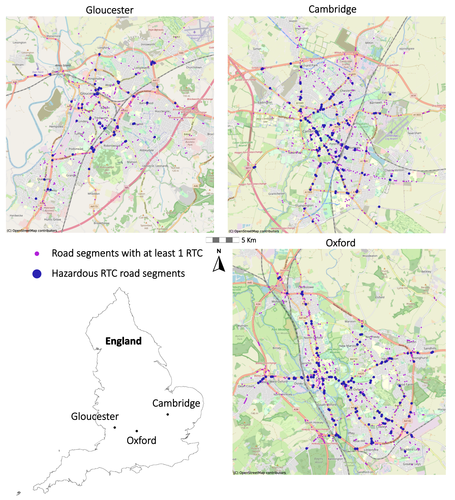
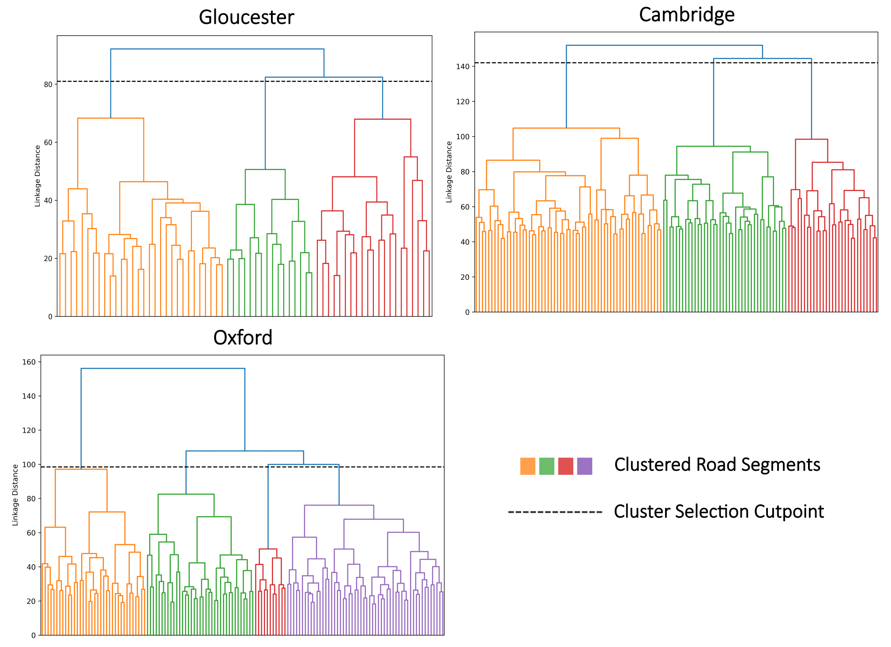
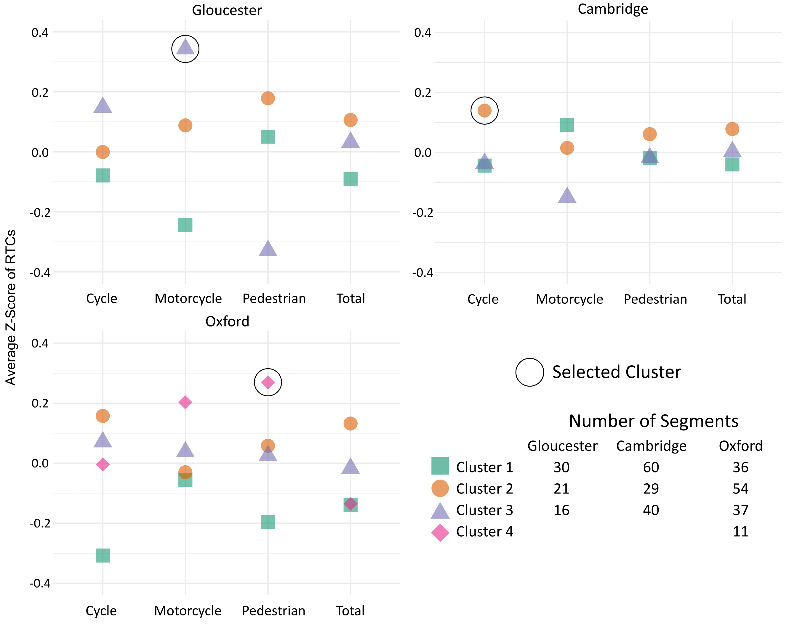

<nav class="toc-fixed" markdown="1">
**Contents**
* TOC
{:toc}
</nav>

This is a companion page for the paper _**Unsupervised feature extraction and clustering of aerial images for understanding hazardous road segments**_ by John Francis, Jonathan Bright, Saba Esnaashari, Youmna Hashem, Deborah Morgan, and Vincent Straub. Tables and figures presented below may be downloaded and reused under a Creative Commons Attribution 4.0 International license. The page is best viewed on a desktop device.

## Summary

Satellite and aerial image data are becoming more widely available, and analysis techniques based on supervised learning are advancing their use in a wide variety of remote sensing contexts. However, supervised learning requires training datasets which are not always available or easy to construct. In this respect, **unsupervised machine learning** techniques present important advantages. This work presents a novel pipeline to demonstrate how available **aerial imagery** can be used to better the provision of services related to the built environment, using the case study of **road traffic collisions** (RTCs) across three cities in the UK. In this paper, we show how **aerial imagery** can be leveraged to extract latent features of the built environment from the purely visual representation of top-down images. Through the **clustering of hazardous road segments** with these latent image features, this work demonstrates how aerial images and machine learning can provide a data-driven aid for road safety experts to enhance their nuanced understanding of how and where different types of RTCs occur.

## Background

Globally, approximately 1.3 million people die each year because of RTCs, and a majority of these deaths fall among vulnerable road users such as pedestrians and cyclists. In the UK, fatal or serious injuries occur on public roads every 16 minutes. In 2020, the United Nations General Assembly resolved to halve the number of global deaths and injuries from RTCs by 2030, noting that the overwhelming majority of these cases are preventable. To achieve this ambitious goal, new technologies and data will be required to enhance road safety experts’ implementation of RTC interventions.

## Methodological Pipeline

We present a pipeline that extracts meaning from aerial images with minimal supervision, and focus on three case study locations within the UK, Cambridge, Gloucester, and Oxford, to demonstrate the application of the pipeline for road safety analysis.

  

&nbsp;&nbsp;&nbsp;&nbsp;&nbsp;&nbsp;&nbsp;&nbsp;&nbsp;&nbsp;&nbsp;&nbsp;&nbsp;  **Figure 1.** Methodological Pipeline 

Figure 1 shows that first, road networks and aerial images were combined into one dataset of evenly spaced road segment points, which were further linked to RTC data. Then, a convolutional autoencoder (CAE), principal component analysis (PCA), and hierarchical clustering are used to extract image features from the data before grouping road segments for analysis and interpretation.

**Road Traffic Collision Data**

RTC data is based on the point-level incidents provided by the Department for Transport's road accidents and safety statistics publication for the years 2017-2020 and compiled with the stats19 R package which enables access to the UK’s official RTC database. Importantly, the RTC data used in this article only includes collisions involving personal injury on public roads which have been reported to police within 30 days. In the UK, data on vehicular damage-only RTCs do not generate a police report and incident counts are not published. Figure 2 below maps show the location of each of the 1,575 road segments which contained at least one RTC in each of the three cities under study. For final analyses, this study focuses only on 334 hazardous road segments, also shown below2, which are defined here as points that contained at least three RTCs over the study period, similar to definitions used throughout Europe.

 **Figure 2.** Locations of RTC and hazardous RTC road segments across the three UK towns. 

## Clustering of Hazardous RTCs
Agglomerative clustering for Cambridge, Gloucester, and Oxford generated three separate dendrograms shown in Figure 3. The dotted horizontal line in each plot signifies the cut point for choosing the number of clusters, whereby the number of intersecting vertical lines represents the number of final clusters. There is no one size fits all approach to selecting the number of clusters, exemplified by the fact that not each locale was determined to contain the same number of clusters. 

  

&nbsp;&nbsp;&nbsp;&nbsp;&nbsp;&nbsp;&nbsp;&nbsp;&nbsp;&nbsp;&nbsp;&nbsp;&nbsp;  **Figure 3.** Dendrograms used to select the final number of clusters for the three UK towns. Linkage distance should not be compared across the different towns as it depends on the number of variables included in the clustering, which differed by locale. 

After identifying the final number of clusters in each location, descriptive analyses examined the various RTC variables to see if there were differences across clusters. Figure 4 shows selected RTC variables from each locale highlighting some of the most interesting RTC features. The goal of this descriptive analysis was to identify one cluster of interest from each locale to examine in detail based on variation we observed among the different RTC variables. Looking at the breakdown of RTCs by type within each cluster of Gloucester, one cluster combines road segments with a higher average rate of RTCs involving motorcycles than either of the other two clusters. In Cambridge, another cluster stands out as having a high average number of RTCs involving cyclists. Alternatively, in Oxford RTCs involving pedestrians were observed at a higher rate in one cluster than any of the other clusters. These three clusters will be examined qualitatively through visual inspection and mapping to explore the type of insights that can be gained from this method.

  

&nbsp;&nbsp;&nbsp;&nbsp;&nbsp;&nbsp;&nbsp;&nbsp;&nbsp;&nbsp;&nbsp;&nbsp;&nbsp;  **Figure 4.** Dot plots of selected RTC variables by cluster in each of the three UK towns. A Z-score of 0 denotes a mean level of that type of RTC for the specified locale, Z-scores should not be compared across locales. 

## Visual Interpretation of Clusters

Figure 5 shows a visual inspection of five randomly chosen road segments from the chosen clusters. Each road segment is shown with their two paired buffers. Policymakers from these cities will be best positioned to interpret the clusters and determine what interventions might be appropriate, however there are some high-level conclusions that can be made from a simple visual inspection

**Gloucester**
Roundabouts appear in nearly all the images of the selected cluster. Given the high rate of RTCs involving motorcycles within this cluster, it could be that motorcycles have particular difficulties with roundabouts in Gloucester, perhaps emphasizing the need for clarity in their right of way assignments. This echoes Gloucestershire’s recent Local Transport Plan which called for interventions of increased education programmes aimed at motorcyclists.

**Cambridge**
All of this clusters road segments highlight long straight roadways with merging lanes. This Çambridge cluster also has a high rate of serious RTCs, likely suggesting higher speeds are involved. The danger of these higher speeds could be further enhanced by the curved nature of these intersections. Interestingly, Cambridgeshire has recently begun fast-tracking lower speed limits in selected zones throughout the county to combat this very issue, highlighting one possible intervention which could be used to help reduce RTCs in this cluster. 

**Oxford**
This Oxford cluster's road segments contain the highest rate of RTCs involving pedestrians and appear to be in denser urban areas with T road segments. This could indicate places where pedestrians need to cross the street, but don’t currently have a straightforward means to do so. Targeting this cluster will be essential for Oxford as creating more pedestrian-friendly roads is a key component of Oxfordshire’s Vision Zero plan to eliminate fatalities from RTCs by 2050.

 **Figure 5.** Visual interpretation of the selected cluster for each of the three UK towns. The maps on the right only shown the location of hazardous road segments from the selected cluster, with the randomly chosen images highlighted in red. 

## Takeaways and Future Directions 

In each location, a group of hazardous road segments was reviewed which share similar image-derived features. Because these road segments share common characteristics pulled solely from their built form, when it is found that these road segments also share similar challenges, such as a propensity for RTCs involving pedestrians, policymakers should have more confidence that these locations can be targeted by a comparable set of interventions. By utilizing aerial image features, this work suggests that the similarities found in the built environment in different parts of these cities can be leveraged to create better targeted interventions at reducing future RTCs. Designing a pipeline that utilizes unsupervised ML techniques but is intentionally not fully unsupervised, experts can be kept in the analytic loop to leverage their domain knowledge for enhanced qualitative analysis of hazardous road segments. 

This research was designed to demonstrate how aerial imagery and ML methods can be leveraged to aid decisions that should reduce RTCs on public roads and improve governmental decision making. Building off this work, it is easy to see how similar methodologies could utilize aerial imagery to better understand other factors related to the built environment such as crime, energy use, pollution, wildlife management, and food access, to name but a few.

## Citation
John Francis, Jonathan Bright, Saba Esnaashari et al. Unsupervised feature extraction and clustering of aerial images for understanding hazardous road segments, 16 March 2023, PREPRINT (Version 1) available at Research Square [https://doi.org/10.21203/rs.3.rs-2678278/v1](https://doi.org/10.21203/rs.3.rs-2678278/v1). 

## About us
This is a project by John Francis, Jonathan Bright, Saba Esnaashari, Youmna Hashem, Deborah Morgan, and Vincent Straub. We are researchers in the Public Policy Programme at the Alan Turing Institute, you can read more about the programme and institute at: [https://www.turing.ac.uk/research/research-programmes/public-policy](https://www.turing.ac.uk/research/research-programmes/public-policy). 

## Contact
Corresponding authors: [jfrancis@turing.ac.uk](mailto:jfrancis@turing.ac.uk).
