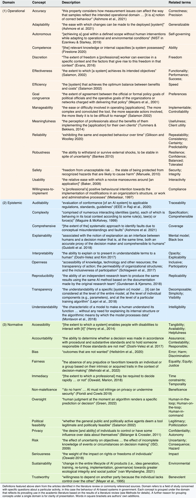

<nav class="toc-fixed" markdown="1">
**Contents**
* TOC
{:toc}
</nav>

This is a companion page for the paper _**Artificial intelligence in government: Concepts, standards, and a unified framework**_ by Vincent Straub, Deborah Morgan, Jonathan Bright, and Helen Margetts. Tables and figures presented below may be downloaded and reused under a Creative Commons Attribution 4.0 International license. The page is best viewed on a desktop device.

## Summary

As artificial intelligence (AI) is adopted by government, we argue that a balanced account is needed to understand the consequences of embedding AI into a public sector context. In this paper, we unify theoretical efforts across social and technical disciplines by mapping over 100 different terms used in the  study of AI. We inductively sort these into three distinct semantic groups, which we call the (a) operational, (b) epistemic, and (c) normative domains. We then propose three new  concepts to study AI-based systems for government (AI-GOV) in an integrated, forward-looking manner: (1) **operational fitness**, (2) **epistemic completeness**, and (3) **normative salience**. Finally, we use these concepts as dimensions in a typological framework of AI-based systems in government and connect each with emerging AI technical measurement standards.

## Background

Recent advances in artificial intelligence (AI) hold promise to improve government. Key tasks that governments have already been able to use AI for to improve service delivery include detection, prediction, and simulation. Notable applications range from facial-recognition in policing and recidivism prediction in criminal justice, to the use of virtual agents in process automation and forecasting future needs in social services. Yet, as public agencies begin to adopt AI applications, it is critical that these are embedded using standard operational procedures, clear epistemic criteria, and are in alignment with the normative concerns of society.

## List of concepts

To capture the full breadth of analytical perspectives needed to understand AI-GOV, we advance a bottom-up approach and first inductively map the multidisciplinary study of AI. Based on an integrative literature review, we identify over 100 concepts that have frequently featured in technical, social scientific, and humanistic literature concerned with the study the attributes of AI systems and group these into three domains.

&nbsp;&nbsp;&nbsp;&nbsp;&nbsp;&nbsp;&nbsp;&nbsp;&nbsp;&nbsp;&nbsp;&nbsp;&nbsp;  **Table 1.** Concepts used in the study of AI-based systems in government categorised by domain 

  

## Concept map

The labels we give to the three domains we use to group concepts are the (a) **operational**, (b) **epistemic**, and (c) **normative domain**, briefly defined below (see paper for details). The concepts in each of the three domains are not necessarily synonymous but are all used to discuss AI-GOV in a similar way. Each domain, therefore, loosely functions as a ‘semantic field’, an aggregate of words that all share a core meaning related to a specific topic.

**Operational domain**

The meaning and specific topic shared by concepts in the operational domain broadly relates to understanding the routine activities and functioning of AI-GOV, a particular AI application, administration, bureaucratic actor(s), or policy. 

**Epistemic domain**

Epistemic domain concepts are understood to predominantly deal with knowledge-related attributes, or understanding of, AI-GOV, which are here taken to include a particular AI application, administration, bureaucratic actor(s), or policy.

**Normative domain**

The meaning and topic that concepts in the normative domain collectively express relate to the entitlements, values, and principles of political morality that affected parties hold towards, and expect of, AI-GOV, a particular AI application, administration, bureaucratic actor(s), or policy.

 **Figure 1.** Concepts frequently used to study AI-based systems in government. A concept map connects operational, epistemic, and normative domain (first level nodes) core concepts (second level nodes) and related terms (third level nodes). See Table 1 for a definition of each concept. Size of nodes and weight of arcs are for illustrative purposes and encode no extra information. 

## New concepts
Based on our mapping of the AI in government field, we contend that a new conceptual framework is needed to integrate the diverse conceptual strands that currently permeate scholarship. Here, we try to do so in the following way: we first propose three new, multi-faceted concepts for studying AI-GOV, before using these to construct a novel conceptual 'typology' of AI-GOV, a method to classify observations in terms of their conceptual attributes. We label the new concepts we introduce **operational fitness**, **epistemic completeness**, and **normative salience**, defined below in Table 2.

&nbsp;&nbsp;&nbsp;&nbsp;&nbsp;&nbsp;&nbsp;&nbsp;&nbsp;&nbsp;&nbsp;&nbsp;&nbsp;  **Table 2.** Proposed dimensions to analyse and classify AI systems in government 

  

Table 3 provides full-length definitions of the scales proposed for each dimension and relates each to emerging measurements standards, recommended metrics and methods for the measurement and evaluation of AI technologies. 

&nbsp;&nbsp;&nbsp;&nbsp;&nbsp;&nbsp;&nbsp;&nbsp;&nbsp;&nbsp;&nbsp;&nbsp;&nbsp;  **Table 3.** Characteristics of proposed dimensions to classify AI-based systems in government 

  

## Typology

Our typology of government AI-based systems is formed of three dimensions (concepts), introduced above: operational fitness, epistemic completeness, and normative variance. In making use of these dimensions, our typology serves two main functions. It is both theory-building in the sense that it
serves to characterize AI-GOV and further explicate the meaning of each dimension, and classificatory, in that it places illustrative examples of different types of AI-GOV in conceptually appropriate cells.

 **Figure 2.** Classifying types of AI-based systems in government. A classification schema places select types of AI-based systems in government along three main axes: normative salience, operational fitness, and epistemic completeness. Systems incorporating complex machine learning models (e.g., neural networks, boosted decision trees, random forests) are contrasted with those using simpler ones (e.g., logistic regression, decision lists). ‘Complex lethal autonomous weapons systems’ are classed as highly contested systems (red box), which exhibit high normative salience and possess advanced operational fitness. A 3-point scale for each dimension is adopted for conceptual parsimony; it is anticipated that future standards for grading real-world systems may use different scales. The draft EU AI Act, for instance, uses a 4-point scale to classify the risk level of an AI system. Where possible, placement of systems is informed by surveys of public attitudes towards AI, otherwise systems are placed using authors’ own interpretation. 

## Terminology 

Since we are pursuing a unified account of AI in government, we follow the definitional path trodden by studies on the potential of AI. We in turn use the term ‘AI system’ broadly to refer to a data-driven, machine-based system that can complete—with some degree of autonomy and learning ability—a specific cognitive task (or set of tasks), using ML, agent computing, or related techniques. Unsurprisingly, many other terms are also used in discussions of AI in government; ‘algorithmic system’ and ‘automated decision system’ feature prominently in policy and legal articles, for instance. We adopt ‘AI system’, as this arguably better distinguishes contemporary systems from earlier generations of computer technology, in terms of their unique, data-powered nature and advanced analytics capabilities. Adopting this definition nevertheless enables us to conduct a conceptual analysis that is not restricted only to existing ML-based applications, although much of the scholarship we cover focuses on this. Moreover, we further employ ‘AI-GOV’ to emphasize that all government AI systems operate within social and institutional contexts.

## Citation
Straub, V. J., Morgan, D., Bright, J., and Margetts, H. (2022). Artificial intelligence in government: Concepts, standards, and a unified framework. arXiv preprint arXiv:2210.17218. DOI: [https://doi.org/10.48550/arXiv.2210.17218](https://doi.org/10.48550/arXiv.2210.17218). 
  
You can also use this [BibTeX entry](https://github.com/vincejstraub/ai-gov-framework/blob/main/CITATION.bib).

## About us
This is a project by Vincent Straub, Deborah Morgan, Jonathan Bright, and Helen Margetts. We are researchers in the Public Policy Programme at the Alan Turing Institute, you can read more about the programme and institute at: [https://www.turing.ac.uk/research/research-programmes/public-policy](https://www.turing.ac.uk/research/research-programmes/public-policy). 

## Contact
Corresponding authors: [vstraub@turing.ac.uk](mailto:vstraub@turing.ac.uk) and [jbright@turing.ac.uk](mailto:jbright@turing.ac.uk).
